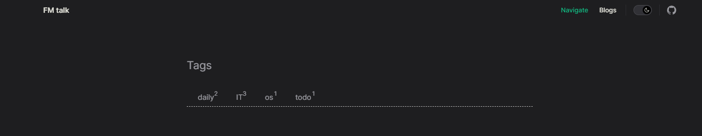
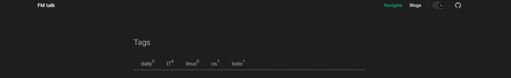
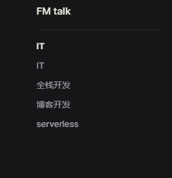

## 一、博客框架

​	本博客是基于`vitepress`开发的静态页面。

​	[vitepress](https://github.com/vitejs/vite) -- 基于`vite` `Vue3` 驱动的静态站点生成器。它允许在`md`格式文件中使用`vue3`语法。

## 二、博客目录解析

```
├─docs						------  博客主体
|  ├─index.md						------  博客入口文件
|  |     ├─dist								------打包后的项目文件（部署文件）
|  |     ├─theme							------博客style
|  |     ├─config.js						------vitepress配置文件
|  ├─.vitepress						------  博客配置文件及主页内容
|  ├─public							------  公共资源 储存图片、视频、音频等
|  ├─navigate						------  导航页内容
|  ├─mdBase							------  md文档存放处
├─.gitignore
├─package.json
├─yarn.lock
```

本博客实现了自动通过fileTree来渲染页面的功能，主要分为两个部分：

### Navigate页面博客分类实现

博客在页面渲染前将首先获取 /docs/mdBase 目录下的文件结构，根据文件结构来渲染页面。

例如mdBase 目录文件结构如下

```
├─mdBase
|  ├─daily
|  ├─IT
|  ├─os
|  ├─todo
```

获取mdBase 下的一级目录 `daily` `IT` `os`  `todo` ，然后渲染在Navigate 页面中，效果如下。



fileTree的分类功能是在`dev`或`build`指令时触发的，我们直接在mdBase下创建一个新的目录名为 `linux`，则需要重新`dev`启动博客，此时目录结构为

```
├─mdBase
|  ├─daily
|  ├─IT
|  ├─os
|  ├─todo
|  ├─linux
```

效果如下



### 博客页面侧边栏实现

获取各个分支下的目录结构，根据md文档来渲染页面

例如IT 目录文件结构如下

```
├─IT
|  ├─image     //存放图片资源
|  ├─index.md
|  ├─全栈开发.md
|  ├─博客开发.md
|  ├─serverless.md
```

效果如下



因为每个blog分类的主页面是`index.md` ，渲染后有些不好看。所以在渲染过程中博客会自动进行一些处理，将index的名字处理为分类名，例如IT分类下的index也是IT。

## 三、问题与思考

### 本地图片渲染

vitepress的本地图片渲染是个问题，例如当希望博客中渲染一些图片时，你写入的实际上是一段字符串，其中包含了截图的路径，当图片在本地存储时，该路径就是存储图片的绝对路径。例如

``

md格式文件会自动解析这一串字符串，并到对应路径寻找图片，随后渲染到博客上。

但当我们真正部署博客时，博客是不太可能回到你本人的主机上寻找该绝对路径的图片的，因此想要在vitepress中渲染图片，就必须将本地图片保存在项目中。

我的解决方案是在分类下创建image目录来存放图片资源。

例如IT目录中的image文件夹（或是vitepress提供的public目录）就是用来存放待渲染的本地图片资源的。

但如果每次希望渲染图片都需要先将图片复制到image目录下，再手动配置路径，这一番操作未免太过麻烦。

#### 目前有两种优化方案，但暂未施行

1. 利用vitepress提供的hook，即dev或build时，在解析md文档格式前，先对博客内容进行一遍预处理：首先寻找到md文档内的图片格式字符串，解析出其中的绝对路径，将绝对路径下的图片复制到image目录下，然后更改md文档中图片格式字符串的路径，设想改为 ``。完成自动化渲染。
2. 后端提供图片资源。

#### 方案分析

方案1：该处理方式的可行性较高，但性能较差，例如若某博客内全部都是非本地的图片资源，则该方案就是在白白遍历一遍所有的blog并将网上的图片资源下载到本地，浪费空间和时间。

方案2：暂不考虑后端服务，但可以考虑应用serverless服务提供图片资源。

### 

## 四、博客部署

​	我将博客部署于`github page`上。

​	`github page`是`github`为用户提供的静态资源管理管理站点，你可以将你的静态页面（例如个人博客）免费部署在这里。

​	你也可以为你的站点添加域名，例如我为我的博客绑定了域名 `firstmeet.store` ，你可以通过这个网址访问我的博客。

​	具体的部署和域名绑定操作，请前往[github官方](https://pages.github.com/)查看。